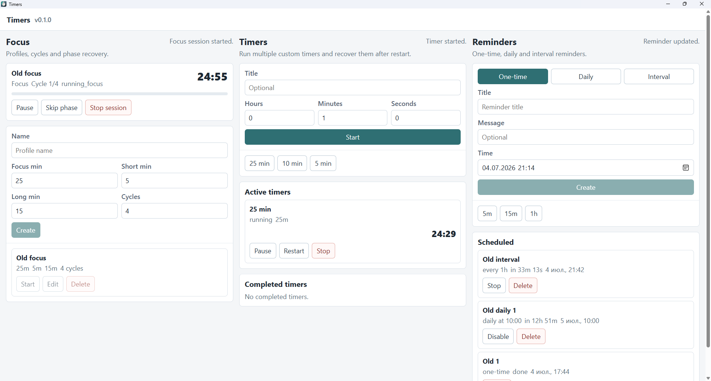

# Timers

Timers - локальное desktop-приложение для фокус-сессий, произвольных таймеров и напоминаний.

Проект помогает держать короткие временные сценарии в одном месте: запускать фокус-профили, быстро ставить таймеры из пресетов, создавать одноразовые и повторяющиеся напоминания. Приложение работает локально, без аккаунта и облака. Никакие метрики не собираются, никакие ваши данные никуда не отправляются.

## Зачем

Timers заменяет набор отдельных утилит одним предсказуемым инструментом для повседневной работы: фокус, перерывы, бытовые таймеры и регулярные напоминания.



_Timers v0.1.0 Windows preview: фокус-сессия, произвольный таймер и напоминания в одном desktop-окне._

## Версия 0.1.0

Цель версии 0.1.0 - рабочая desktop-версия для Linux и Windows с базовыми сценариями управления временем:

- фокус-сессии с этапами фокуса и перерыва;
- произвольные таймеры и пресеты;
- одноразовые, ежедневные и интервальные напоминания;
- локальное хранение данных;
- системные уведомления и звуковые сигналы;
- базовая история;
- восстановление состояния после сна ОС или перезапуска.

## Релизы и скачивание

Публичные сборки публикуются в [GitHub Releases](https://github.com/kubasovp/timers/releases). Первый опубликованный релиз - [v0.1.0 Windows preview](https://github.com/kubasovp/timers/releases/tag/v0.1.0) с Windows x64 установщиками. Linux-артефакты будут добавлены после отдельной проверки на Linux.

Для версий `0.1.x` обновление предполагается вручную: скачать новый установщик из GitHub Releases и установить его поверх предыдущей версии. Локальные данные должны сохраниться после обновления.

## Запуск

```bash
npm install
npm run dev
```

Для desktop-режима через Tauri:

```bash
npm run tauri:dev
```

## Проверки

```bash
npm run check
```

## Документация

Архитектура, roadmap, ADR, тестовый план и правила ведения документации находятся в [docs/](docs/README.md).

## Лицензия

См. [LICENSE](LICENSE).
