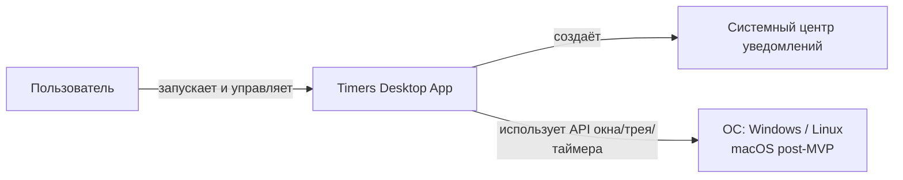

# C4 Level 1 — System Context

Status: Draft  
Owner: github.com/kubasovp  
Last reviewed (UTC): 2026-07-01
Scope: Внешние акторы и границы системы Timers  
Canonical: docs/L1-system-context.md

```mermaid
flowchart LR
  U[Пользователь]
  S[Timers Desktop App]
  OS[ОС: Windows / Linux\nmacOS post-MVP]
  N[Системный центр уведомлений]

  U -->|запускает и управляет| S
  S -->|создаёт| N
  S -->|использует API окна/трея/таймера| OS
```
