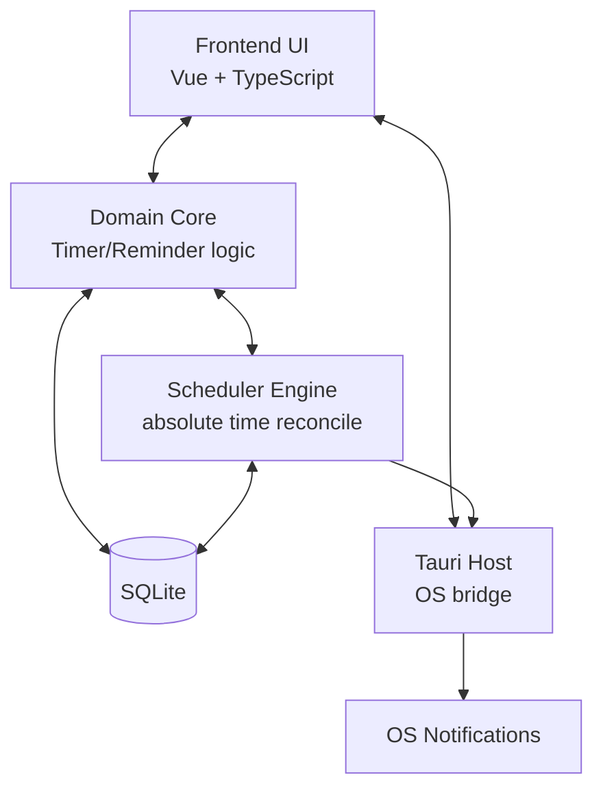

# C4 Level 2 — Container

Status: Draft  
Owner: github.com/kubasovp  
Last reviewed (UTC): 2026-05-06  
Scope: Контейнеры приложения и ключевые связи  
Canonical: docs/L2-container.md

```mermaid
flowchart TB
  UI[Frontend UI\nVue + TypeScript]
  CORE[Domain Core\nTimer/Reminder logic]
  SCHED[Scheduler Engine\nabsolute time reconcile]
  DB[(SQLite)]
  TAURI[Tauri Host\nOS bridge]
  NOTIF[OS Notifications]

  UI <--> CORE
  CORE <--> SCHED
  CORE <--> DB
  SCHED <--> DB
  UI <--> TAURI
  SCHED --> TAURI
  TAURI --> NOTIF
```
