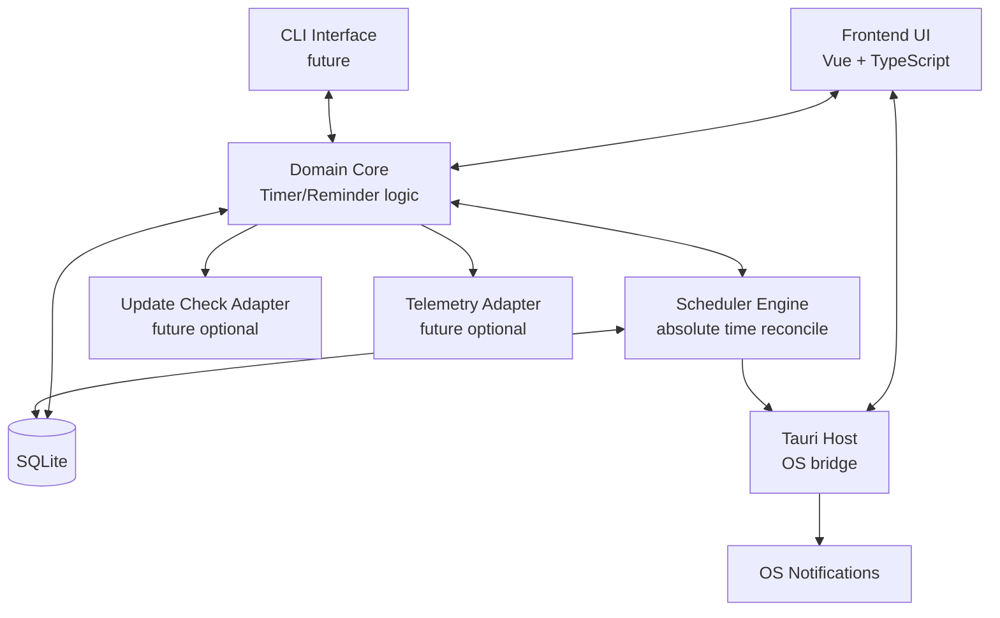

# C4 Level 2 — Container

Status: Draft  
Owner: github.com/kubasovp  
Last reviewed (UTC): 2026-05-07  
Scope: Контейнеры приложения и ключевые связи  
Canonical: docs/L2-container.md

### Пояснения к контейнерам (future-ready)

- `Domain Core` и `Scheduler` образуют платформенно-агностичное ядро.
- `Frontend UI` и будущий `CLI Interface` — разные адаптеры к одному ядру.
- `Update Check Adapter` и `Telemetry Adapter` в MVP могут быть отключены; их отказ не должен ломать локальные сценарии.
