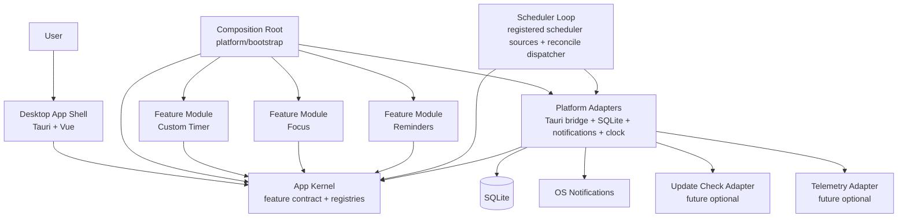

# C4 Level 2 — Container

Status: Draft  
Owner: github.com/kubasovp  
Last reviewed (UTC): 2026-07-01  
Scope: Контейнеры приложения и ключевые связи  
Canonical: docs/L2-container.md

### Пояснения к контейнерам

- `Desktop App Shell` — desktop UI и Tauri WebView. Shell рендерит зарегистрированные routes/navigation и вызывает commands/queries через kernel.
- `App Kernel` — минимальное ядро: feature contract, registries, command/query contracts, scheduler contracts. Kernel не содержит бизнес-логики Focus/Timer/Reminder.
- `Composition Root` — bootstrap/wiring: выбирает статический набор feature-модулей, создаёт registration context и связывает kernel с platform adapters.
- `Feature Module: Custom Timer` — быстрые таймеры, пресеты, active custom timer sessions.
- `Feature Module: Focus` — focus profiles, focus/break cycles, focus session state machine.
- `Feature Module: Reminders` — one-time/daily/interval reminders, snooze, missed events, reminder state machine.
- `Platform Adapters` — конкретные интеграции с Tauri, SQLite, OS notifications, clock и runtime config.
- `Scheduler Loop` — общий loop, который работает с зарегистрированными scheduler sources. Scheduler не знает бизнес-деталей модулей.
- `Update Check Adapter` и `Telemetry Adapter` — будущие optional-adapters. Их отказ не должен ломать локальные сценарии.

### Архитектурное правило

Feature-модули подключаются к приложению через `AppFeature.register(context)`. Они не импортируют внутренности друг друга и не зависят напрямую от concrete platform adapters.

Kernel не импортирует feature-модули и platform adapters. Platform/bootstrap — единственное место, где выбирается статический набор feature-модулей.

Feature persistence зависит от storage contracts; `platform/sqlite` реализует эти contracts и инжектится через composition root.
