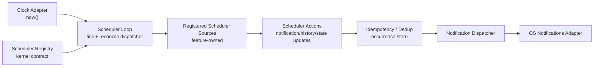

# C4 Level 3 — Scheduler Loop Component

Status: Draft  
Owner: github.com/kubasovp  
Last reviewed (UTC): 2026-07-01
Scope: Внутренние части platform scheduler loop и registered scheduler sources
Canonical: docs/L3-scheduler-component.md

### Правило зависимости

Scheduler loop не импортирует feature repositories и не знает business details Focus/Timer/Reminder. Он получает `SchedulerSource` из kernel registry и вызывает `reconcile(now)`.

Feature-модули владеют расчётом своего состояния: completion detection, missed reminder handling, next-fire calculation и любые domain-specific transitions живут внутри соответствующего feature-модуля.

Общий scheduler отвечает за tick cadence, порядок вызова sources, idempotency/dedup, retry/failure policy и передачу notification requests в platform notifications adapter.
